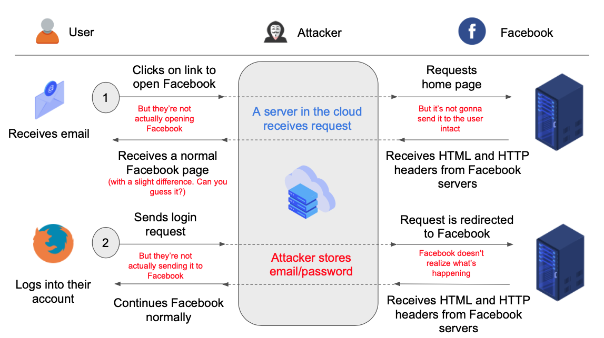

# fb-mitm

Imitates Facebook's home page to demonstrate a MITM attack. Created for Security Presentation in CSE 4471 @ The Ohio State University.

FOR EDUCATIONAL PURPOSES ONLY.

Licensed under The MIT License.